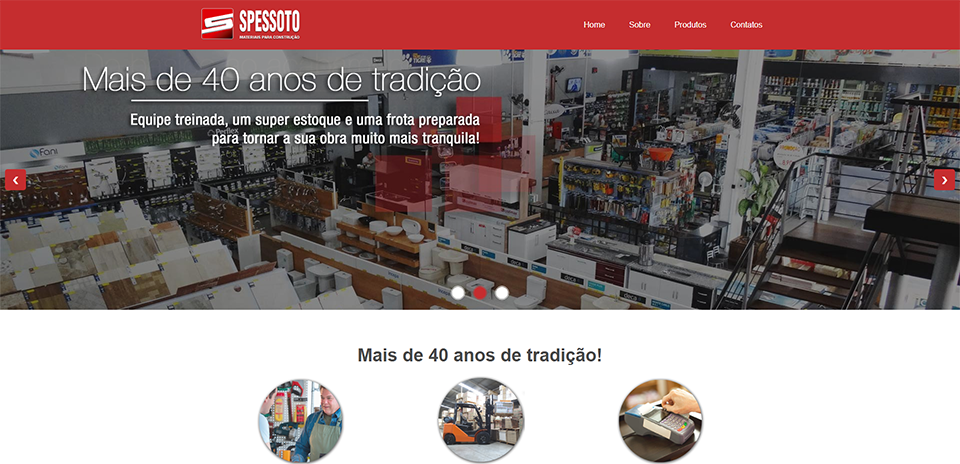

# 🧱 Clone do site da loja Spessoto Materiais para Construção

> 🇧🇷 Este projeto é um clone do site da loja de materiais de construção **Spessoto**, criado com fins educacionais.  
> 🇺🇸 This project is a clone of the **Spessoto** construction materials store website, developed for educational purposes.

[🔗 Acesse o repositório no GitHub](https://github.com/KlaudioSilva/spessoto-clone)

---

## 📸 Preview



---

## 📌 Sobre

- 🇧🇷 Este projeto faz parte do meu processo de aprendizado em **HTML**, **CSS** e **JavaScript**.  
- O objetivo foi reproduzir de forma fiel a estrutura e layout do site original, aprimorando minhas habilidades em construção de páginas web responsivas.

- 🇺🇸 This project is part of my learning journey with **HTML**, **CSS**, and **JavaScript**.  
- The goal was to faithfully replicate the structure and layout of the original website to improve my skills in building responsive web pages.

---

## 🛠️ Tecnologias / Technologies

- HTML5  
- CSS3  
- JavaScript

---

## ▶️ Como rodar o projeto / How to run the project

1. Clone o repositório / Clone the repository:
   ```bash
   git clone https://github.com/KlaudioSilva/spessoto-clone.git

2. Acesse a pasta do projeto / Enter the project folder:
   ```bash
   cd spessoto-clone

3. Abra o arquivo index.html no seu navegador / Open the index.html file in your browser.

---

## 📁 Estrutura do Projeto / Project Structure

    📦 spessoto-clone
    ┣ 📁 images
    ┣ 📁 css
    ┣ 📁 js
    ┣ 📄 index.html
    ┣ 📄 README.md
    ┗ 📄 LICENSE


⚠️ Aviso / Disclaimer
- 🇧🇷 Este site é apenas um projeto pessoal de estudo. Não possuo qualquer vínculo com a empresa Spessoto.
- 🇺🇸 This website is just a personal study project. I have no affiliation with the Spessoto company.